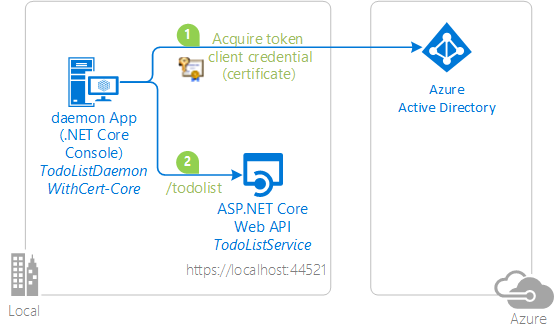
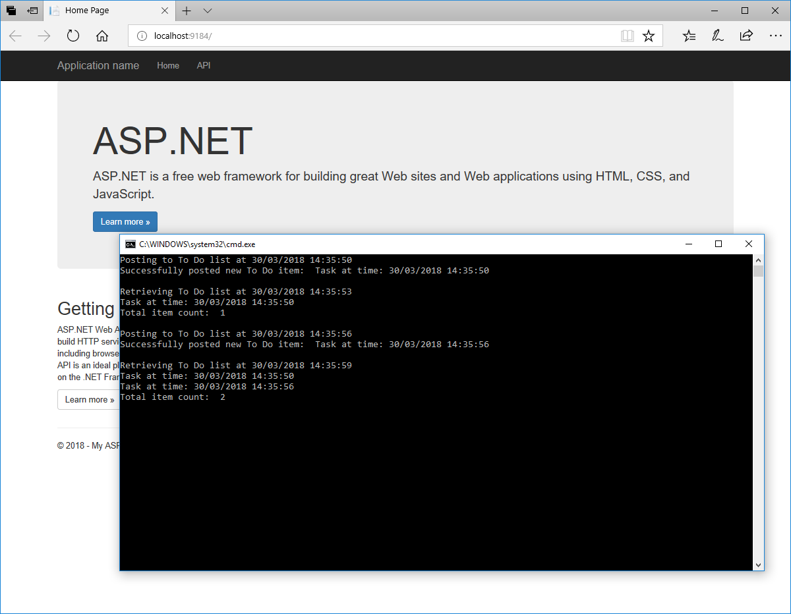

# Authenticating to Azure AD in daemon apps with certificates


<!--

-->

> There's a newer version of this sample! Check it out: https://github.com/azure-samples/ms-identity-dotnetcore-daemon-console
>
> This newer sample takes advantage of the Microsoft identity platform (formerly Azure AD v2.0).
>
> While still in public preview, every component is supported in production environments

## About this sample

### Overview

In this sample, a .NET core console application (`TodoListDaemonWithCert-core`) calls an ASP.Net Core Web API (`TodoListService`) using its own app identity. This scenario is useful for situations where headless or unattended job or process needs to run with its own application identity, instead of as a signed in user's identity. The application uses the [Active Directory Authentication Library (ADAL)](https://docs.microsoft.com/en-us/azure/active-directory/develop/active-directory-authentication-libraries) to get a token from Azure AD using the [OAuth 2.0 Client Credentials Grant Flow](https://docs.microsoft.com/en-us/azure/active-directory/develop/v1-oauth2-client-creds-grant-flow), where the client credential is a certificate.

This sample is the equivalent, in .NET Core, to the [dotnet-daemon-certificate-credential](https://github.com/Azure-Samples/active-directory-dotnet-daemon-certificate-credential) sample, which is targets .NET desktop.



> Looking for previous versions of this code sample? Check out the tags on the [releases](../../releases) GitHub page.

### Scenario

Once the service started, start the `TodoListDaemon` desktop application. Once started, it will repeatedly:

- adds items to the todo list maintained by the service,
- lists the existing items.

No user interaction is involved in both applications.



## How to run this sample

To run this sample, you'll need:

- [Visual Studio 2017](https://aka.ms/vsdownload) or just the [.NET Core SDK](https://www.microsoft.com/net/learn/get-started)
- An Internet connection
- A Windows machine (necessary if you want to run the app on Windows)
- An OS X machine (necessary if you want to run the app on Mac)
- A Linux machine (necessary if you want to run the app on Linux)
- An Azure Active Directory (Azure AD) tenant. For more information on how to get an Azure AD tenant, see [How to get an Azure AD tenant](https://azure.microsoft.com/en-us/documentation/articles/active-directory-howto-tenant/)
- A user account in your Azure AD tenant. This sample will not work with a Microsoft account (formerly Windows Live account). Therefore, if you signed in to the [Azure portal](https://portal.azure.com) with a Microsoft account and have never created a user account in your directory before, you need to do that now.

### Step 1:  Clone or download this repository

From your shell or command line:

```Shell
git clone https://github.com/Azure-Samples/active-directory-dotnetcore-daemon-certificate-credential.git
```

or download and exact the repository .zip file.

> Given that the name of the sample is pretty long, and so are the name of the referenced NuGet packages, you might want to clone it in a folder close to the root of your hard drive, to avoid file size limitations on Windows.

### Step 2:  Register the sample with your Azure Active Directory tenant, create a certificate, and configure the code

There are two projects in this sample. Each needs to be separately registered in your Azure AD tenant. To register these projects, you can:

- either follow the steps [Step 2: Register the sample with your Azure Active Directory tenant](#step-2-register-the-sample-with-your-azure-active-directory-tenant) and [Step 3:  Configure the sample to use your Azure AD tenant](#choose-the-azure-ad-tenant-where-you-want-to-create-your-applications)
- or use PowerShell scripts that:
  - **automatically** creates the Azure AD applications and related objects (passwords, permissions, dependencies) for you
  - modify the Visual Studio projects' configuration files.

If you want to use this automation:

1. On Windows, run PowerShell and navigate to the root of the cloned directory
1. In PowerShell run:

   ```PowerShell
   Set-ExecutionPolicy -ExecutionPolicy RemoteSigned -Scope Process -Force
   ```

1. Run the script to create your Azure AD application and configure the code of the sample application accordingly.
1. In PowerShell run:

   ```PowerShell
   .\AppCreationScripts\Configure.ps1
   ```

   > Other ways of running the scripts are described in [App Creation Scripts](./AppCreationScripts/AppCreationScripts.md)

1. Open the Visual Studio solution and click start to run the code.

If you don't want to use this automation, follow the steps below.

#### Choose the Azure AD tenant where you want to create your applications

As a first step you'll need to:

1. Sign in to the [Azure portal](https://portal.azure.com) using either a work or school account or a personal Microsoft account.
1. If your account is present in more than one Azure AD tenant, select your profile at the top right corner in the menu on top of the page, and then **switch directory**.
   Change your portal session to the desired Azure AD tenant.

#### Register the service app (TodoListService-Core-Cert)

1. Navigate to the Microsoft identity platform for developers [App registrations](https://go.microsoft.com/fwlink/?linkid=2083908) page.
1. Select **New registration**.
1. When the **Register an application page** appears, enter your application's registration information:
   - In the **Name** section, enter a meaningful application name that will be displayed to users of the app, for example `TodoListService-Core-Cert`.
   - Change **Supported account types** to **Accounts in this organizational directory only**.
1. Select **Register** to create the application.
1. On the app **Overview** page, find the **Application (client) ID** value and record it for later. You'll need it to configure the Visual Studio configuration file for this project.

#### Secure your Web API by defining Application Roles (permission)

If you don't do anything more, Azure AD will provide an access token for any client application (using the client credential flow) which requests an access token for your Web API (for its App ID URI).

In this step we are going to ensure that Azure AD only provides a token to the applications to which the Tenant admin grants consent. We are going to limit the access to our TodoList client using authorization.

##### Add an app role to the manifest

1. While still in the blade for your  application, click **Manifest**.
1. Edit the manifest by locating the `appRoles` setting and adding an application roles. The role definition is provided in the JSON block below.  Leave the `allowedMemberTypes` to "Application" only.
1. Save the manifest.

The content of `appRoles` should be the following (the `id` can be any unique GUID)

```JSon
"appRoles": [
    {
    "allowedMemberTypes": [ "Application" ],
    "description": "Accesses the TodoListService-Core-Cert as an application.",
    "displayName": "access_as_application",
    "id": "ccf784a6-fd0c-45f2-9c08-2f9d162a0628",
    "isEnabled": true,
    "lang": null,
    "origin": "Application",
    "value": "access_as_application"
    }
],
```

##### Ensure that tokens Azure AD issues tokens for your Web API only to allowed clients

In the  Web API, you can check the presence of the app role in the access token presented by the client yourself, or you can have Azure Active Directory do it for you. You can configure your Web API, so that it issues an access token for your Web API only to applications which were approved by the tenant admin. For this:

1. On the app **Overview** page for your app registration, select the hyperlink with the name of your application in **Managed application in local directory** (note this field title can be truncated for instance Managed application in ...)

   > When you select this link you will navigate to the **Enterprise Application Overview** page associated with the [service principal](https://docs.microsoft.com/en-us/azure/active-directory/develop/app-objects-and-service-principals) of your application in the tenant where you created it. You can navigate back to the app registration page by using the back button of your browser.

1. Select the **Properties** page in the **Manage** section of the Enterprise application pages
1. If you want AAD to restrict access to your Web API to only a certain number of clients, first, set **User assignment required?** to **Yes**.

   > **Important security tip**
   >
   > By setting **User assignment required?** to **Yes**, AAD will check the app role assignments of the clients when they request an access token for the Web API (see app permissions below). If the client was not be assigned to any AppRoles, AAD would just return the error `invalid_client: AADSTS501051: Application xxxx is not assigned to a role for the xxxx`
   >
   > If you keep **User assignment required?** to **No**, <span style='background-color:yellow; display:inline'>Azure AD  won’t check the app role assignments when a client requests an access token to your Web API</span>. Therefore, any daemon client (that is any client using client credentials flow) would be able to obtain the access token for the  Web API just by specifying its audience (App ID URi). Now, there is a second level of security as your Web API can, as is done in this sample, verify that the application has the right role (which was authorized by the tenant admin). It does it by validating that the access token has a `roles` claim, and that this claims contains `access_as_application`.

1. Select **Save**

#### Register the client app (TodoListDaemon-Core-Cert)

1. Navigate to the Microsoft identity platform for developers [App registrations](https://go.microsoft.com/fwlink/?linkid=2083908) page.
1. Select **New registration**.
1. When the **Register an application page** appears, enter your application's registration information:
   - In the **Name** section, enter a meaningful application name that will be displayed to users of the app, for example `TodoListDaemon-Core-Cert`.
   - Leave **Supported account types** on the default setting of **Accounts in this organizational directory only**.
   - In the Redirect URI (optional) section, select **Web** in the combo-box.
      > Even if this is a desktop application, this is a confidential client application hence the *Application Type* being 'Web', which might seem counter intuitive.
   - For the Redirect URI*, enter `https://<your_tenant_name>/TodoListDaemon-Core-Cert`, replacing `<your_tenant_name>` with the name of your Azure AD tenant.
1. Select **Register** to create the application.
1. On the app **Overview** page, find the **Application (client) ID** value and record it for later. You'll need it to configure the Visual Studio configuration file for this project.

#### Create a self-signed certificate

To complete this step, you will use the `New-SelfSignedCertificate` Powershell command. You can find more information about the New-SelfSignedCertificat command [here](https://docs.microsoft.com/en-us/powershell/module/pkiclient/new-selfsignedcertificate).

1. Open PowerShell and run New-SelfSignedCertificate with the following parameters to create a self-signed certificate in the user certificate store on your computer:

```PowerShell
$cert=New-SelfSignedCertificate -Subject "CN=TodoListDaemonWithCert" -CertStoreLocation "Cert:\CurrentUser\My"  -KeyExportPolicy Exportable -KeySpec Signature
```

1. If needed, you can later export  this certificate using the "Manage User Certificate" MMC snap-in accessible from the Windows Control Panel. You can also add other options to generate the certificate in a different
store such as the Computer or service store (See [How to: View Certificates with the MMC Snap-in](https://docs.microsoft.com/en-us/dotnet/framework/wcf/feature-details/how-to-view-certificates-with-the-mmc-snap-in)).

#### Add the certificate as a key for the TodoListDaemon application in Azure AD

##### Generate a textual file containing the certificate credentials in a form consumable by AzureAD

Copy and paste the following lines in the same PowerShell window. They generate a text file in the current folder containing information that you can use to upload your certificate to Azure AD:

```PowerShell
$bin = $cert.RawData
$base64Value = [System.Convert]::ToBase64String($bin)
$bin = $cert.GetCertHash()
$base64Thumbprint = [System.Convert]::ToBase64String($bin)
$keyid = [System.Guid]::NewGuid().ToString()
$jsonObj = @{customKeyIdentifier=$base64Thumbprint;keyId=$keyid;type="AsymmetricX509Cert";usage="Verify";value=$base64Value}
$keyCredentials=ConvertTo-Json @($jsonObj) | Out-File "keyCredentials.txt"
```

The content of the generated "keyCredentials.txt" file has the following schema:

```Json
[
    {
        "customKeyIdentifier": "$base64Thumbprint_from_above",
        "keyId": "$keyid_from_above",
        "type": "AsymmetricX509Cert",
        "usage": "Verify",
        "value":  "$base64Value_from_above"
    }
]
```

##### Associate the certificate credentials with the Azure AD Application

To associate the certificate credential with the `TodoListDaemon-Core-Cert` app object in Azure AD, you'll need to edit the application manifest.
In the Azure portal app registration page for the `TodoListDaemon-Core-Cert`, click on **Manifest**. An editor window opens enabling you to edit the manifest.
You need to replace the value of the `keyCredentials` property (that is `[]` if you don't have any certificate credentials yet), with the content of the keyCredential.txt file.

To do this replacement in the manifest, you have two options:

- Option 1: Edit the manifest in place by clicking **Edit**, replacing the `keyCredentials` value, and then clicking **Save**.
  > Note that if you refresh the web page, the key is displayed with different properties than what you have input. In particular, you can now see the endDate, and stateDate, and the value is shown as null. This is normal.

- Option 2: **Download** the manifest to your computer, edit it with your favorite text editor, save a copy of it, and **Upload** this copy. You might want to choose this option if you want to keep track of the history of the manifest.

Note that the `keyCredentials` property is multi-valued, so you may upload multiple certificates for richer key management. In that case copy only the text between the curly brackets.

1. Select the **API permissions** section
   - Click the **Add a permission** button and then,
   - Ensure that the **My APIs** tab is selected
   - In the list of APIs, select the API `TodoListService-Core-Cert`.
   - In the **Application permissions** section, ensure that the right permissions are checked: **access_as_application**
   - Select the **Add permissions** button

1. At this stage permissions are assigned correctly but the client app does not allow interaction. 
   Therefore no consent can be presented via a UI and accepted to use the service app. 
   Click the **Grant/revoke admin consent for {tenant}** button, and then select **Yes** when you are asked if you want to grant consent for the
   requested permissions for all account in the tenant.
   You need to be an Azure AD tenant admin to do this.

### Step 3:  Configure the sample to use your Azure AD tenant

In the steps below, "ClientID" is the same as "Application ID" or "AppId".

Open the solution in Visual Studio to configure the projects

#### Configure the service project

1. Open the `TodoListService\appsettings.json` file
1. Find the app key `Domain` and replace the existing value with your AAD tenant name.
1. Find the app key `TenantId` and replace the existing value with Tenant ID.
1. Find the app key `ClientId` and replace the existing value with the application ID (clientId) of the `TodoListService` application copied from the Azure portal.

#### Configure the client project

1. Open the `TodoListDaemonWithCert-Core\appsettings.json` file
1. Find the app key `Tenant` and replace the existing value with your AAD tenant name.
1. Find the app key `ClientId` and replace the existing value with the application ID (clientId) of the `TodoListDaemon` application copied from the Azure portal.
1. Find the app key `CertName` and replace the existing value with Certificate.
1. Find the app key `TodoListResourceId` and replace the existing value with the application ID (clientId) of the `TodoListService` application copied from the Azure portal.
1. Find the app key `TodoListBaseAddress` and replace the existing value with the base address of the TodoListService project (by default `https://localhost:44351/`).

### Step 4: Run the sample

#### Option 1: Run the sample from Visual Studio

Clean the solution, rebuild the solution, and run it.  You might want to go into the solution properties and set both projects as startup projects, with the service project starting first. To do this, you can for instance:

 1. Right click on the solution in the solution explorer and choose **Set Startup projects** from the context menu.
 2. choose **Multiple startup projects**
    - TodoListDaemonWithCert: **Start**
    - TodoListService: Start **Start without debugging**
 3. In the Visual Studio tool bar, press the **start** button: a web window appears running the service and a console application runs the daemon application under debugger. you can set breakpoints to understand the call to ADAL.NET.

The daemon will add items to its To Do list and then read them back.

#### Option 2: Run the sample from any platform

See [Get Started with .NET Core](https://www.microsoft.com/net/core#windowsvs2017) to learn how to run the sample on Linux and Mac (```dotnet run```)

## How to deploy this sample to Azure

This project has one WebApp / Web API projects. To deploy them to Azure Web Sites, you'll need, for each one, to:

- create an Azure Web Site
- publish the Web App / Web APIs to the web site, and
- update its client(s) to call the web site instead of IIS Express.

### Create and Publish the `TodoListService` to an Azure Web Site

1. Sign in to the [Azure portal](https://portal.azure.com).
2. Click New in the top left-hand corner, select Web + Mobile --> Web App, select the hosting plan and region, and give your web site a name, for example, `TodoListService-contoso.azurewebsites.net`.  Click Create Web Site.
3. Once the web site is created, click on it to manage it.  For this set of steps, download the publish profile and save it.  Other deployment mechanisms, such as from source control, can also be used.
4. Switch to Visual Studio and go to the TodoListService project.  Right click on the project in the Solution Explorer and select Publish.  Click Import, and import the publish profile that you downloaded.
5. On the Connection tab, update the Destination URL so that it is https, for example [https://TodoListService-contoso.azurewebsites.net](https://TodoListService-contoso.azurewebsites.net). Click Next.
6. On the Settings tab, make sure Enable Organizational Authentication is NOT selected.  Click Publish.
7. Visual Studio will publish the project and automatically open a browser to the URL of the project.

### Update the Active Directory tenant application registration for `TodoListService`

1. Navigate to the [Azure portal](https://portal.azure.com).
2. On the top bar, click on your account and under the **Directory** list, choose the Active Directory tenant containing the `TodoListService` application.
3. On the applications tab, select the `TodoListService` application.
4. From the Settings -> Properties and Settings -> Reply URLs menus, update the Sign-On URL, and Reply URL fields to the address of your service, for example [https://TodoListService-contoso.azurewebsites.net](https://TodoListService-contoso.azurewebsites.net). Save the configuration.

### Update the `TodoListDaemon` to call the `TodoListService` Running in Azure Web Sites

1. In Visual Studio, go to the `TodoListDaemon` project.
2. Open `TodoListDaemonWithCert-Core\appsettings.json`.  Only one change is needed - update the `todo:TodoListBaseAddress` key value to be the address of the website you published,
   for example, [https://TodoListService-contoso.azurewebsites.net](https://TodoListService-contoso.azurewebsites.net).
3. Run the client! If you are trying multiple different client types (for example, .Net, Windows Store, Android, iOS) you can have them all call this one published web API.

> NOTE: Remember, the To Do list is stored in memory in this TodoListService sample. Azure Web Sites will spin down your web site if it is inactive, and your To Do list will get emptied.
Also, if you increase the instance count of the web site, requests will be distributed among the instances. To Do will, therefore, not be the same on each instance.

## About the Code

### Client side: the daemon app

The code acquiring a token is entirely located in the `TodoListDaemonWithCert-Core\Program.cs` file.
The `AuthenticationContext` is created line 55

```CSharp
authContext = new AuthenticationContext(authority);
```

Then a `ClientAssertionCertificate` is instantiated line 69, from the `TodoListDaemonWithCert-Core` application's Client ID and a certificate (`cert`) which was found from the certificate store (see lines 72-89).

```CSharp
certCred = new ClientAssertionCertificate(clientId, cert);
```

This instance of `ClientAssertionCertificate` is used in the `GetAccessToken()` method is as an argument to `AcquireTokenAsync` to get a token for the Web API (line 125)
`GetAccessToken()` is itself called from `PostTodo()` and `GetTodo()` methods.

```CSharp
result = await authContext.AcquireTokenAsync(todoListResourceId, certCred);
```

This token is then used as a bearer token to call the Web API (line 164 and 194)

```CSharp
httpClient.DefaultRequestHeaders.Authorization = new AuthenticationHeaderValue("Bearer", result.AccessToken)
```

### Service side: how we protected the API

On the service side, the code directing .NET to validate the access token is in `AzureAdServiceCollectionExtensions.cs`. It only validates the audience of the application (the App ID URI) by setting `JwtBearerOptions` properties.

```CSharp
public void Configure(string name, JwtBearerOptions options)
{
    options.Audience = _azureOptions.ClientId;
    options.Authority = $"{_azureOptions.Instance}{_azureOptions.TenantId}";
}
```

However, the controllers also validate that the client has a `roles` claim of value `access_as_application`. It returns an Unauthorized result otherwise.

```CSharp
if (!User.HasClaim("roles", "access_as_application"))
    return new UnauthorizedResult();
```

## How to recreate this sample

First, in Visual Studio, create an empty solution to host the  projects.  Then, follow these steps to create each project.

### Creating the TodoListService Project

1. In the solution, create a new ASP.Net MVC web API project called TodoListService and while creating the project, click the Change Authentication button, select Organizational Accounts, Cloud - Single Organization, enter the name of your Azure AD tenant, and set the Access Level to Single Sign On.  You will be prompted to sign in to your Azure AD tenant.  NOTE:  You must sign in with a user that is in the tenant; you cannot, during this step, sign in with a Microsoft account.
2. In the `Models` folder, add a new class called `TodoItem.cs`.  Copy the implementation of TodoItem from this sample into the class.
3. Add a new, empty, Web API 2 controller called `TodoListController`.
4. Copy the implementation of the TodoListController from this sample into the controller.  Don't forget to add the `[Authorize]` attribute to the class.
5. In `TodoListController` resolving missing references by adding `using` statements for `System.Collections.Concurrent`, `TodoListService.Models`, `System.Security.Claims`.

### Creating the TodoListDaemon Project

See how the code was created for the service in the [active-directory-dotnet-native-aspnetcore](https://github.com/Azure-Samples/active-directory-dotnet-native-aspnetcore#how-the-code-was-created) sample, except that here the controller is not expecting any user.

## Community Help and Support

Use [Stack Overflow](http://stackoverflow.com/questions/tagged/adal) to get support from the community.
Ask your questions on Stack Overflow first and browse existing issues to see if someone has asked your question before.
Make sure that your questions or comments are tagged with [`adal` `dotnet`].

If you find a bug in the sample, please raise the issue on [GitHub Issues](../../issues).

To provide a recommendation, visit the following [User Voice page](https://feedback.azure.com/forums/169401-azure-active-directory).

## Contributing

If you'd like to contribute to this sample, see [CONTRIBUTING.MD](/CONTRIBUTING.md).

This project has adopted the [Microsoft Open Source Code of Conduct](https://opensource.microsoft.com/codeofconduct/). For more information, see the [Code of Conduct FAQ](https://opensource.microsoft.com/codeofconduct/faq/) or contact [opencode@microsoft.com](mailto:opencode@microsoft.com) with any additional questions or comments.

## More information

For more information, see ADAL.NET's conceptual documentation:

- [ADAL.NET's conceptual documentation](https://github.com/AzureAD/azure-activedirectory-library-for-dotnet/wiki)
- [Client credential flows](https://github.com/AzureAD/azure-activedirectory-library-for-dotnet/wiki/Client-credential-flows)
- [Using the acquired token to call a protected Web API](https://github.com/AzureAD/azure-activedirectory-library-for-dotnet/wiki/Using-the-acquired-token-to-call-a-protected-Web-API)
- [Customizing Token cache serialization](https://github.com/AzureAD/azure-activedirectory-library-for-dotnet/wiki/Token-cache-serialization)
- [How to: Add app roles in your application and receive them in the token](https://docs.microsoft.com/en-us/azure/active-directory/develop/howto-add-app-roles-in-azure-ad-apps)

For more information about how OAuth 2.0 protocols work in this scenario and other scenarios, see [Authentication Scenarios for Azure AD](http://go.microsoft.com/fwlink/?LinkId=394414).

## FAQ

- [How to use a pre-existing certificate](https://github.com/Azure-Samples/active-directory-dotnet-daemon-certificate-credential/issues/29) instead of generating a self signed certificate.
